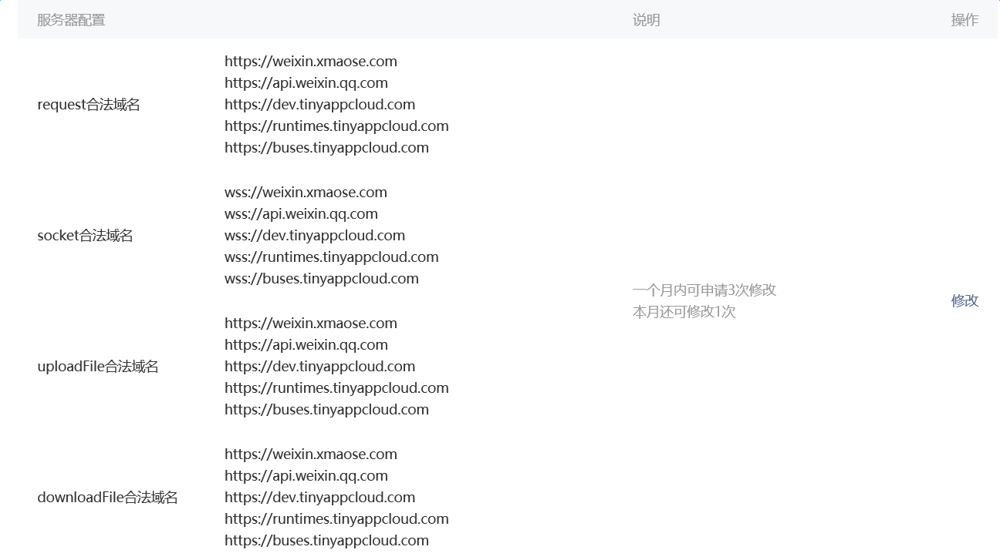

# 本篇文章主要讲述在以下四种环境下部署Demo应用到小应用云并运行
* 微信小程序环境。
* nodejs环境。
* html5环境。
* 本地调试环境（此模式可脱机运行，便于用本地调试器调试代码逻辑）。

# 准备工作
## 获取bucky_sdk
从 https://github.com/buckyos/bucky_sdk 下载`小应用云`sdk。SDK包含以下文件：

几种工具：
+ tools.js -- 发布，停止，开始app的工具
+ proxytools.js -- 生成proxy包的工具
+ node_loader.js -- nodejs环境下的启动工具
+ make_wx_demo.js -- 生成微信小程序下可使用的demo
+ clean_local.js -- 清除本地调试后产生的临时文件

几类在不同环境使用的core文件：
+ wx_core.js -- 微信小程序环境
+ h5_core.js -- html5环境
+ node_core.js -- nodejs环境
+ local_core.js -- 本地调试环境

demos目录，包含官方的account例子。

## 确保sdk目录可以使用下列npm包,sdk提供的各种工具会依赖这些库
```
npm install xmlhttprequest  
npm install deepcopy  
npm install adm-zip
```

## 代码及配置
无论在什么环境下运行，首先要完成自己的代码逻辑及配置。下面以官方demo的account模块为例。account模块主要实现了一个***登录（失败）-注册-再登录（成功）***的流程，其包含了两个包client和userinfo，以及程序配置app.json和全局配置knowledge.json。因userinfo为跑在后端的模块，请使用官方提供的proxytools(proxytools.js)为userinfo生成运行在客户端的代理模块userinfo_proxy。具体逻辑可以参考模块代码。

(注：以下所有的命令都在sdk目录下执行)

首先要修改app.json中的appid为你拿到的内测appid
>"appID" : "YOUR_APP_ID" => "appID" : "xxxxxxx" 

然后运行构建proxy包的工具
```
node proxytools.js -package ./demos/account/packages/userinfo -out ./demos/account/packages/userinfo_proxy
```

至此，account目录结构如下：
><< bucky_sdk/demos/account >>  
>+--app.json  
>+--knowledge.json  
>+--packages  
>+----client  
>+------client.js  
>+------config.json  
>+------onload.js  
>+----userinfo  
>+------userinfo.js  
>+------config.json  
>+------onload.js  
>+----userinfo_proxy  
>+------userinfo.js  
>+------config.json  
>+------onload.js  

## 发布app
理论上，除了本地调试模式外。其他模式都需要将代码发布到`小应用云`上。
使用官方提供的tools.js即可完成代码发布和启动。（具体参数请参见tools的usage）。
若app已经发布并在运行中，下一次发布之前需先stop。发布完成后再start。
注意，例中的appID并非合法的。请自行改为您从`小应用云`获取的appID，否则不能发布成功。
本例中，命令行为：
```
//stop app  
node tools.js -stop -app ./demos/account/app.json  
//pub app, 这里第一次发布，需同时发布knowledge  
node tools.js -pub -packages ./demos/account/packages -app ./demos/account/app.json -knowledges ./demos/account/knowledges.json  
//start app  
node tools.js -start -app ./demos/account/app.json
```

***请注意，更新knowledge是一个需要很小心的工作，相当于重置系统的全部数据。一般来讲，正式的发布，只有第一次需要发布knowledge，当程序运行过一段时间以后，knowledge已经保存了一些数据和信息，除非你非常清楚你需要重置knowledge，否则，在第一次正式发布之后，你都不应该再次更新knowledge。更新和发布knowledge的方法为在pub时带上knowledge参数。***

## 运行
下面我们通过例子来讲解如何将account模块运行在不同的环境中：
### 微信小程序环境
为了方便，我们在bucky_sdk/demos/下提供了一个特化的小脚本make_wx_demo.js，来生成在微信小程序下可以运行的例子。
```
node ./demos/make_wx_demo.js
```

它主要做了如下工作：将微信小程序使用的core模块（wx_core.js）放在小程序目录中。例子中我们放在与pages平级的bucky目录下，同时将需要在本地加载的包放入同一目录中，包的路径为/bucky/packages，本地需要使用的包为client和userinfo_proxy。另外，模块代码也针对微信小程序有修改，在/bucky/packages下面的client.js和userinfo.js前面都会添加一段代码：
```
"use strict";  
var _core = require("../../wx_core.js");  
var BaseLib = _core.BaseLib;  
var ErrorCode =_core.ErrorCode;  
var BX_LOG = _core.BX_LOG;  
var BX_CHECK = _core.BX_CHECK;  
var Application = _core.Application;  
var getCurrentRuntime = _core.getCurrentRuntime;  
var getCurrentApp = _core.getCurrentApp;  
var XARPackage = _core.XARPackage;  
var RuntimeInstance = _core.RuntimeInstance;  
var RuntimeInfo = _core.RuntimeInfo;  
var Device = _core.Device;  
var DeviceInfo = _core.DeviceInfo;  
var OwnerUser = _core.OwnerUser;  
var GlobalEventManager = _core.GlobalEventManager;  
var KnowledgeManager = _core.KnowledgeManager;
```

因微信小程序只提供了require这种方式，所以必须添加这段代码，将小程序中可能用到的core函数和对象先声明一遍。

微信小程序的环境比较特殊，我们需要将app的配置以及所有需要跑在本地的包配置，放在小程序可以看到的地方。一般情况下，这些信息会配置在pages的data字段。包的配置信息包含在每个包目录下的config.json文件中。而app的信息包含在account/app.json中。knowledge不需配置在本地，是跑在后端的。

为了方便，我们的特化脚本会将这些信息生成一个文件，demos/wx_config.json，需要自行粘贴到index.js中的相应位置，完成后的index.js代码如下：


至此，小程序的配置完毕。在小程序工具中创建一个项目，项目目录指定为bucky_sdk/demos/wx。然后点击头像，即可开始登录测试流程。不过在运行之前，请保证我们的域名 (https://weixin.xmaose.com) 已经配置在您微信小程序的设置中：



运行截图如下：


登录返回值：0--成功；3--失败。 注册返回值：0--成功；1--失败。
如果是第一次运行，第一次的login result为3（用户不存在）；register result为0（成功）；last login result为0（成功）
图中为第二次运行。故返回值有所差别。

### 本地调试环境
和微信小程序一样，本地调试环境要先发布一次代码，不过整个过程都可以在无网络的环境下进行。本地调试模式无需stop和start，也无需在发布包时发布knowledge，在发布时请打上-fake参数。
```
node tools.js -pub -packages ./demos/account/packages -app ./demos/account/app.json -fake
```

然后可以使用node_loader工具进行本地测试，本地测试时请带上-local_debug参数，指定knowledge配置文件。
```
node node_loader.js -main ./demos/account/nodeclient.js -app ./demos/account/app.json -local_debug ./demos/account/knowledges.json
```

运行完毕请使用我们提供的clean_local.js来清除本地调试时产生的临时文件。
```
node clean_local.js
```

### nodejs环境
node环境直接运行即可
```
node node_loader.js -main ./demos/account/nodeclient.js -app ./demos/account/app.json
```

### html5环境 `暂时只支持最新版本Chrome`
先修改index.html文件中appMetaInfo.appID为你的appid。
然后直接双击sdk/demos/account/h5下的index.html运行。

#总结
account实现的是一个非常简单的用户管理服务，服务的核心代码只有下面这么多：
```
function Login(username,md5Pwd,onComplete) {  
    let thisRuntime = getCurrentRuntime();  
    let rs = thisRuntime.getRuntimeStorage("/users/");  

    rs.getObject("user." + username,function(objid,usrObj) {  
        if(usrObj) {  
            if(usrObj.password == md5Pwd) {  
                onComplete(0);  
            } else {  
                onComplete(1);  
            }
        } else {  
            onComplete(3);  
        }  
    });  
}  

function Register(username,md5pwd,desc,onComplete) {  
    let thisRuntime = getCurrentRuntime();  
    let rs = thisRuntime.getRuntimeStorage("/users/");  
    let uobj = {};  
    uobj.id = username;  
    uobj.password = md5pwd;  
    uobj.desc = desc;  
   
    let objid = "user." + username;  

    rs.isObjectExists(objid,function(objid,isExists) {  
        if(isExists) {  
            logger.info("user is exists");  
            onComplete(1);  
        } else {  
            logger.info("user not register,will add user");  
            rs.setObject(objid,uobj,function(){  
                logger.info("user register ok");  
                onComplete(0);  
            });  
        }  
    });  
}  
```

只要有js的基础，相信理解上述代码并不困难。完成代码编写后，发布代码到小应用云，我们会在云端为这段代码调度合适的运行容器，实现服务化。


