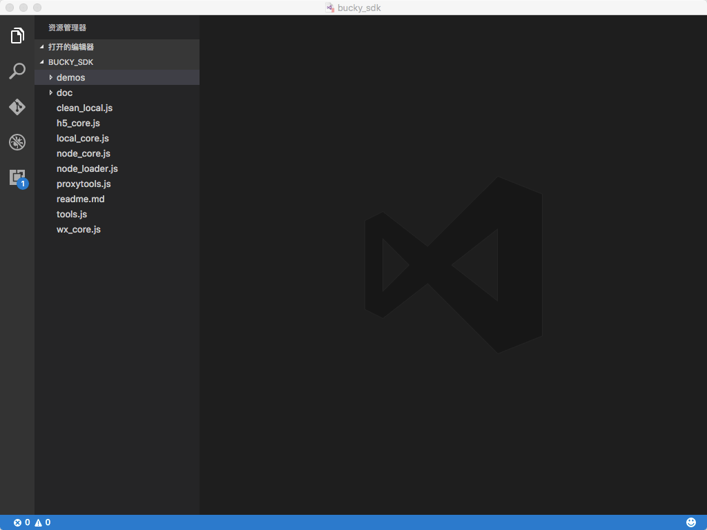
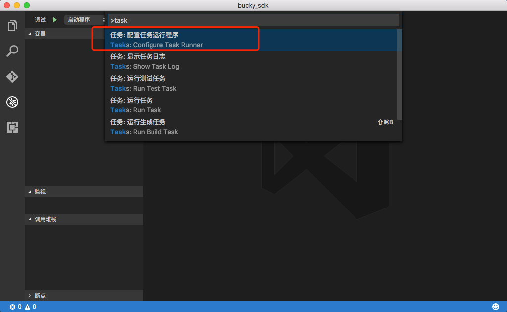

# 在Visual Studio Code 里本机调试小应用云

## 安装Visual Studio Code
下载：https://code.visualstudio.com

## 打开bucky_sdk
点击菜单`文件`->`打开`，选择bucky_sdk所在目录，如图所示：


## 切换到调试面板
1. 熟悉下Visual Studio Code的几个面板
2. 点击左侧的调试图标，切换到调试面板


## 配置本机发布packages任务
 
在这个步骤中，我们要在Visual Studio Code里配置执行如下脚本的任务：
```
node tools.js -pub -packages ./demos/account/packages -app ./demos/account/app.json -knowledges ./demos/account/knowledges.json 
```

1. 按`Control+p`(windows)或者`Command+p`(Mac OSX)调出命令输入框
2. 输入`>task`，弹出创建任务的下拉列表

3. 选择`任务：配置任务运行程序`，出现任务类型列表

4. 选择`Others`,弹出tasks.json文件，该文件位于busky_sdk根目录的`.vscode`目录下：
    - `command`参数指定为`node`
    - `supressTaskName`参数指定为`true`
    - 添加`tasks`数组，
    - 添加一个node程序会执行的任务，`taskName`命名为"pub_fake"
    - `args`参数指定为发布本地包命令行的参数
5. 结果如图：

6. 可以直接按`Control+p`(windows)或者`Command+p`(Mac OSX)，输入`task` 在下拉菜单里选择`pub_fake`执行发布包到本地的动作

## 配置启动参数

在这个步骤中，我们要在Visual Studio Code里配置启动`./demos/account/`这个包的启动参数，原始命令行如下：
```
node node_loader.js -main ./demos/account/nodeclient.js -app ./demos/account/app.json -local_debug ./demos/account/knowledges.json
```

1. 点击工具栏上的配置图标，选择Node.js调试环境

2. 弹出launch.json配置文件，该文件同样位于`.vscode`目录下，编辑该文件
	- 配置`preLaunchTask`，指定名字为之前创建的`pub_task`任务，这样在程序启动的时候，就会自动先发布到本地
    - 配置`program`指定启动程序为`./demos/account/nodeclient.js`
    - 配置`args`数组。
3. 结果如图：


## 设置断点，运行
1. 切换到源码目录面板，打开`demos/account/packages/userinfo/userinfo.js`，在`Login`函数体里设置一个断点

2. 切换到调试面板，查看新加入的断点，已经在断点列表里，可以随时勾选去掉

3. 点击运行图标，启动程序，Visual Studio Code会依次执行发布任务，并启动`demos/account/nodeclient.js`，并在我们设置的断点处停住：


## 参考链接：
- https://code.visualstudio.com/docs/editor/tasks
- https://code.visualstudio.com/Docs/editor/debugging


